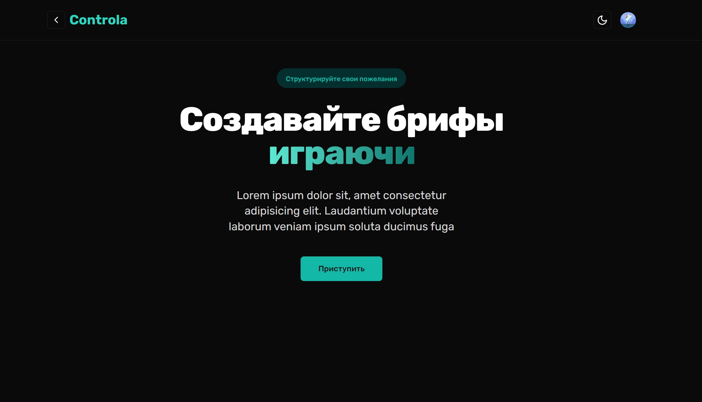

# [Controla](https://controla-24-leu2awpq9-anderbois-projects.vercel.app/)

Our app "Controla" is designed to simplify the process of planning and organizing design projects. It allows you to quickly and easily fill out a multi-step brief form, gather all the necessary information, and receive it in a convenient PDF format. All your projects will be securely stored in the database, and you can return to them at any time to update the information.
---
Наше приложение "Controla" создано, чтобы облегчить процесс планирования и организации дизайн-проектов. Оно позволяет вам быстро и легко заполнить многоступенчатую форму брифа, собрать всю необходимую информацию и получить её в удобном формате PDF. Все ваши проекты будут надежно сохранены в базе данных, и вы сможете в любой момент вернуться к ним и обновить информацию.

> **Warning**
> This project is still in development and is not ready for production use.

## Tech Stack

- **Framework:** [Next.js](https://nextjs.org)
- **Styling:** [Tailwind CSS](https://tailwindcss.com)
- **UI Components:** [shadcn/ui](https://ui.shadcn.com)
- **Form:** [React hook form](https://react-hook-form.com/)
- **Form validation:** [Zod](https://zod.dev/)
- **Database:** [Supabase](https://supabase.com/)

## Features to be implemented

- [x] Authentication with **Clerk**
- [x] Database on **Supabase**
- [x] Validation with **Zod**
- [x] Download PDF file with project date with **React-PDF**
- [ ] File uploads with **uploadthing**
- [ ] Chat
- [ ] Project task manager
